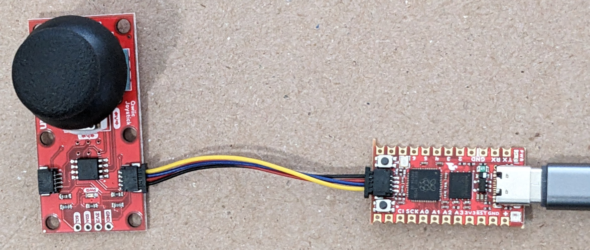

# USB Analog Small Joystick

USB small joystick (also known as a thumbstick) compatible with the Xbox
Adaptive Controller. No soldering.



## Hardware

The joystick connects to the Pro Micro 2040 board using a Qwiic cable.

* SparkFun Pro Micro - RP2040
* SparkFun Qwiic Joystick
* SparkFun Qwiic Cable - 50mm

The following Adafruit board might be a substitute for the SparkFun Pro Micro
RP2040. Stemma QT and Qwiic are mostly compatible. See
https://learn.adafruit.com/introducing-adafruit-stemma-qt/sparkfun-qwiic

* Adafruit Trinkey QT2040 - RP2040 USB Key with Stemma QT

## Software

## Raspberry Pi Pico (RP2040) Arduino Board Package

https://github.com/earlephilhower/arduino-pico

## Libraries

Install both libraries using the IDE Library Manager.

* Adafruit TinyUSB Library
* SparkFun Qwiic Joystick Arduino Library

## Troubleshooting

Be sure to change the Tool | USB Stack from "Pico SDK" to "Adafruit TinyUSB". If this is not done,
the compile will fail with the following message.

```
 #error TinyUSB is not selected, please select it in "Tools->Menu->USB Stack"
```
